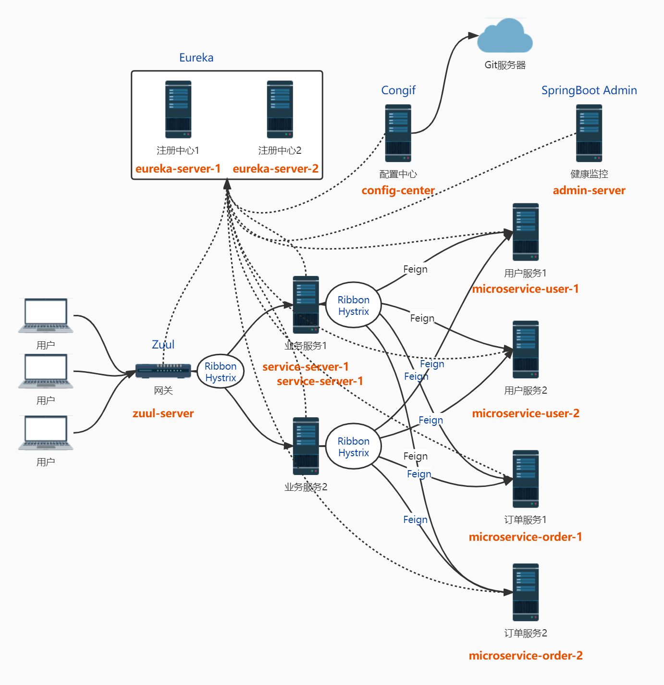
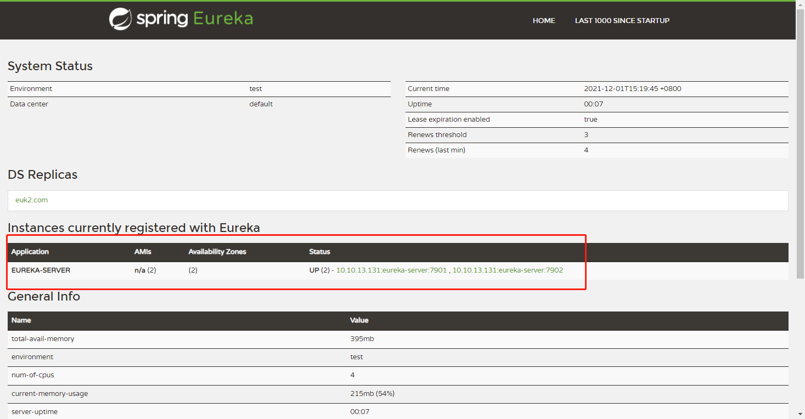

# SpringCloud-Bucket
## SpringCloud技术栈全家桶Demo

### 项目介绍

#### 包含组件：

- 注册中心：Eureka
- 远程调用：Feign
- 负载均衡：Ribbon
- 断路器：Hystrix
- 网关：Zuul
- 配置中心：SpringCloud Config
- 链路追踪：Sleuth、Zipkin
- 健康检查：SpringBootAdmin

#### 项目结构：




### 运行

//todo


### 详细搭建步骤

#### Eureka：

0.因为是在一台pc上做集群，所以在开始前需要修改一下hosts文件

```
#Eureka
127.0.0.1  euk1.com
127.0.0.1  euk2.com
```

1.使用Spring Initializr创建一个SpringBoot工程，引入eureka-server依赖

```xml
<dependency>
	<groupId>org.springframework.cloud</groupId>
	<artifactId>spring-cloud-starter-netflix-eureka-server</artifactId>
</dependency>
```

2.修改application.yml

```yaml
server:
  port: 7901

spring:
  application:
    name: eureka-server

eureka:
  instance:
    #主机名
    hostname: euk1.com
  client:
    #是否将自己注册到Eureka Server,默认为true，表明该服务会向eureka注册自己的信息,单节点则false
    register-with-eureka: true
    #是否从Eureka server获取注册信息，由于多节点，需要同步其他节点数据，用true,单节点则false
    fetch-registry: true
    #设置服务注册中心的URL，用于client和server端交流
    service-url:
      defaultZone: http://euk2.com:7902/eureka/

management:
  endpoint:
    shutdown:
      enabled: true
```

3.启动类EurekaServer1Application增加注解

```java
@EnableEurekaServer
```

4.创建EurekaServer2，步骤同上。修改EurekaServer2的application.yml

```yml
server:
  port: 7902

spring:
  application:
    name: eureka-server

eureka:
  instance:
    #主机名
    hostname: euk2.com
  client:
    #是否将自己注册到Eureka Server,默认为true，表明该服务会向eureka注册自己的信息,单节点则false
    register-with-eureka: true
    #是否从Eureka server获取注册信息，由于多节点，需要同步其他节点数据，用true,单节点则false
    fetch-registry: true
    #设置服务注册中心的URL，用于client和server端交流
    service-url:
      defaultZone: http://euk1.com:7901/eureka/

management:
  endpoint:
    shutdown:
      enabled: true
```

5.分别启动两个工程，访问http://localhost:7901/或http://localhost:7902/得到下图则配置成功




