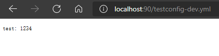

# SpringCloud技术栈全家桶Demo

## 项目介绍

### 包含组件：

- 注册中心：Eureka
- 远程调用：Feign
- 负载均衡：Ribbon
- 断路器：Hystrix
- 网关：Zuul
- 配置中心：SpringCloud Config
- 链路追踪：Sleuth、Zipkin
- 健康监控：SpringBootAdmin

### 项目结构：


## 运行

//todo


## 详细搭建步骤

### 注册中心（Eureka）

0.因为是在一台pc上做集群，所以在开始前需要修改一下hosts文件

```
#Eureka
127.0.0.1  euk1.com
127.0.0.1  euk2.com
```

1.使用Spring Initializr创建一个SpringBoot工程，引入eureka-server依赖

```xml
<dependency>
	<groupId>org.springframework.cloud</groupId>
	<artifactId>spring-cloud-starter-netflix-eureka-server</artifactId>
</dependency>
```

2.修改application.yml

```yaml
server:
  port: 7901

spring:
  application:
    #应用名称 其他服务在Eureka中根据这个名字找到对应的服务
    name: eureka-server

eureka:
  instance:
    #主机名
    hostname: euk1.com
  client:
    #是否将自己注册到Eureka Server,默认为true，表明该服务会向eureka注册自己的信息,单节点则false
    register-with-eureka: true
    #是否从Eureka server获取注册信息，由于多节点，需要同步其他节点数据，用true,单节点则false
    fetch-registry: true
    #设置服务注册中心的URL，用于client和server端交流
    service-url:
      defaultZone: http://euk2.com:7902/eureka/
```

3.启动类EurekaServerApplication增加注解

```java
@EnableEurekaServer
```

4.创建EurekaServer2，步骤同上。修改EurekaServer2的application.yml

```yml
server:
  port: 7902

spring:
  application:
    #应用名称 其他服务在Eureka中根据这个名字找到对应的服务
    name: eureka-server

eureka:
  instance:
    #主机名
    hostname: euk2.com
  client:
    #是否将自己注册到Eureka Server,默认为true，表明该服务会向eureka注册自己的信息,单节点则false
    register-with-eureka: true
    #是否从Eureka server获取注册信息，由于多节点，需要同步其他节点数据，用true,单节点则false
    fetch-registry: true
    #设置服务注册中心的URL，用于client和server端交流
    service-url:
      defaultZone: http://euk1.com:7901/eureka/
```

5.分别启动两个工程，访问 http://localhost:7901/或http://localhost:7902/得到下图则配置成功


### 配置中心（SpringCloud Config）

在单体应用，配置写在配置文件中，没有什么大问题。如果要切换环境 可以切换不同的profile，但在微服务中：

1. 微服务比较多。成百上千，配置很多，需要集中管理；
2. 管理不同环境的配置；
3. 需要动态调整配置参数，更改配置不停服。

1.这里新建一个仓库[SpringCloud-ConfigCenter](https://gitee.com/GALAace/spring-cloud-config-center)存放配置文件，文件命名规则为

> ```
> /{name}-{profiles}.properties
> /{name}-{profiles}.yml
> /{name}-{profiles}.json
> /{label}/{name}-{profiles}.yml
> ```
>
> name 服务名称
>
> profile 环境名称，开发、测试、生产：dev qa prd
>
> lable 仓库分支、默认master分支

2.使用Spring Initializr创建一个SpringBoot工程，引入config-server依赖

```xml
<dependency>
	<groupId>org.springframework.cloud</groupId>
	<artifactId>spring-cloud-config-server</artifactId>
</dependency>
```

3.修改application.yml

```yaml
server:
  port: 90

spring:
  application:
    name: config-center
  cloud:
    config:
      server:
        git:
          uri: https://gitee.com/GALAace/spring-cloud-config-center.git #配置文件所在的Git仓库地址
          default-label: master #配置文件分支
          search-paths: configs  #配置文件所在目录
#          username: Git账号
#          password: Git密码

eureka:
  client:
    service-url:
      defaultZone: http://euk1.com:7901/eureka/

```

4.启动类ConfigCenterApplication增加注解

```java
@EnableConfigServer
```

5.启动工程，访问http://localhost:90/testconfig-dev.yml 可以得到我们在配置文件仓库中的配置




### 服务

服务分为业务服务（service-server）下面称Consumer，和具体执行功能的服务称Provider（microservice-xxx）；

由Consumer作为客户端调用作为服务端的Provider，他们都需要注册在Eureka上；

使用声明式服务调用，Provider方提供公用API包，Feign通过SpringMVC的注解来加载URI

所有我们先创建一个项目作为API

#### Api

1.使用Spring Initializr创建一个SpringBoot工程，引入依赖

```xml
<!--web 提供web服务-->
<dependency>
	<groupId>org.springframework.boot</groupId>
	<artifactId>spring-boot-starter-web</artifactId>
</dependency>
<!--lombok 简化代码 （可选）-->
<dependency>
	<groupId>org.projectlombok</groupId>
	<artifactId>lombok</artifactId>
</dependency>
```

注意：SpringBoot默认打build配置可能引起打包后其他项目无法依赖的问题，需要修改pom.xml

```xml
	<build>
        <plugins>
                <plugin>
                    <groupId>org.apache.maven.plugins</groupId>
                    <artifactId>maven-compiler-plugin</artifactId>
                    <configuration>
                        <source>1.8</source>
                        <target>1.8</target>
                    </configuration>
                </plugin>
        </plugins>
    </build>
```

2.创建实体和API interface，具体代码参考[common-api](https://github.com/GALAace/SpringCloud-Bucket/tree/main/common-api)

3.使用maven install打包到本地仓库，待Consumer和Provider使用

#### Provider

这里举例的4个Provider结构都是类似的，这里以microservice-user-1为例

1.使用Spring Initializr创建一个SpringBoot工程，引入依赖

```xml
<!--eureka-client 注册eureka-->
<dependency>
    <groupId>org.springframework.cloud</groupId>
    <artifactId>spring-cloud-starter-netflix-eureka-client</artifactId>
</dependency>

<!--config-client 连接配置中心-->
<dependency>
	<groupId>org.springframework.cloud</groupId>
	<artifactId>spring-cloud-config-client</artifactId>
</dependency>

<!--sleuth 链路追踪-->
<dependency>
    <groupId>org.springframework.cloud</groupId>
    <artifactId>spring-cloud-starter-sleuth</artifactId>
</dependency>

<!--zipkin 链路追踪 UI-->
<dependency>
    <groupId>org.springframework.cloud</groupId>
    <artifactId>spring-cloud-starter-zipkin</artifactId>
</dependency>

<!--actuator 健康监控-->
<dependency>
    <groupId>org.springframework.boot</groupId>
    <artifactId>spring-boot-starter-actuator</artifactId>
</dependency>

<!--SpringBootAdmin 健康监控 UI-->
<dependency>
    <groupId>de.codecentric</groupId>
    <artifactId>spring-boot-admin-starter-client</artifactId>
    <version>2.2.1</version>
</dependency>

<!--自定义API-->
<dependency>
    <groupId>com.gala</groupId>
    <artifactId>common-api</artifactId>
    <version>0.0.1-SNAPSHOT</version>
</dependency>

<!--lombok 简化代码 （可选）-->
<dependency>
    <groupId>org.projectlombok</groupId>
    <artifactId>lombok</artifactId>
    <optional>true</optional>
</dependency>
```

2.修改application.yml

```java
server:
    port: 9000
```

3.新建一个bootstrap.yml

bootstrapd加载的优先级比application高，我们在这里配置注册中心和配置中心的信息

```yaml
eureka:
  client:
    service-url:
      defaultZone: http://euk1.com:7901/eureka/

spring:
  application:
    name: microservice-user
  cloud:
    config:
      discovery:
        #通过注册中心查找配置中心
        enabled: true
        #配置中心的服务id
        service-id: config-center
      #环境
      profile: dev
      #分支
      label: master
```

2.新建一个UserController，实现引入的自定义依赖common-api的UserApi接口

```java
@RestController
public class UserController implements UserApi {
    @Override
    public List<User> list() {
        //实现自己的业务
        return null;
    }

    @Override
    public String save(User user) {
        //实现自己的业务
        return null;
    }
}
```

#### Consumer

1.使用Spring Initializr创建一个SpringBoot工程，引入依赖

```xml
<!--eureka-client 注册eureka-->
<dependency>
    <groupId>org.springframework.cloud</groupId>
    <artifactId>spring-cloud-starter-netflix-eureka-client</artifactId>
</dependency>

<!--openfeign 远程调用-->
<dependency>
    <groupId>org.springframework.cloud</groupId>
    <artifactId>spring-cloud-starter-openfeign</artifactId>
</dependency>

<!--config-client 连接配置中心-->
<dependency>
    <groupId>org.springframework.cloud</groupId>
    <artifactId>spring-cloud-config-client</artifactId>
</dependency>

<!--actuator 健康监控-->
<dependency>
    <groupId>org.springframework.boot</groupId>
    <artifactId>spring-boot-starter-actuator</artifactId>
</dependency>

<!--SpringBootAdmin 健康监控 UI-->
<dependency>
    <groupId>de.codecentric</groupId>
    <artifactId>spring-boot-admin-starter-client</artifactId>
    <version>2.2.1</version>
</dependency>

<!--hystrix 断路器-->
<dependency>
    <groupId>org.springframework.cloud</groupId>
    <artifactId>
        spring-cloud-starter-netflix-hystrix
    </artifactId>
</dependency>

<!--hystrix-dashboard 熔断监控 UI-->
<dependency>
    <groupId>org.springframework.cloud</groupId>
    <artifactId>
        spring-cloud-starter-netflix-hystrix-dashboard
    </artifactId>
</dependency>

<!--自定义API-->
<dependency>
    <groupId>com.gala</groupId>
    <artifactId>common-api</artifactId>
    <version>0.0.1-SNAPSHOT</version>
</dependency>

<!--lombok 简化代码 （可选）-->
<dependency>
    <groupId>org.projectlombok</groupId>
    <artifactId>lombok</artifactId>
    <optional>true</optional>
</dependency>
```

##### 远程调用（Feign）

1.启动类ConfigCenterApplication增加注解

```java
@EnableFeignClients
```

2.创建接口，增加注解@FeignClient(name = "{微服务id}") 

```java
@Service
@FeignClient(name = "microservice-user")
public interface UserService extends UserApi {
    
}
```

3.创建Controller，引入UserService

```java
@RestController
public class DemoController {

    @Autowired
    UserService userService;

    @GetMapping("/list")
    public List<User> list(){
        return userService.list();
    }

}
```

4.访问http://localhost:8000/list 可以看到Provider端写的测试数据


##### Ribbon

###### 负载均衡

默认的负载均衡策略是ZoneAvoidanceRule（区域权衡策略）：复合判断Server所在区域的性能和Server的可用性，轮询选择服务器。

除此以外还有：

BestAvailableRule（最低并发策略）：会先过滤掉由于多次访问故障而处于断路器跳闸状态的服务，然后选择一个并发量最小的服务。逐个找服务，如果断路器打开，则忽略。

RoundRobinRule（轮询策略）：以简单轮询选择一个服务器。按顺序循环选择一个server。

RandomRule（随机策略）：随机选择一个服务器。

AvailabilityFilteringRule（可用过滤策略）：会先过滤掉多次访问故障而处于断路器跳闸状态的服务和过滤并发的连接数量超过阀值得服务，然后对剩余的服务列表安装轮询策略进行访问。

WeightedResponseTimeRule（响应时间加权策略）：据平均响应时间计算所有的服务的权重，响应时间越快服务权重越大，容易被选中的概率就越高。刚启动时，如果统计信息不中，则使用RoundRobinRule(轮询)策略，等统计的信息足够了会自动的切换到WeightedResponseTimeRule。响应时间长，权重低，被选择的概率低。反之，同样道理。此策略综合了各种因素（网络，磁盘，IO等），这些因素直接影响响应时间。

RetryRule（重试策略）：先按照RoundRobinRule(轮询)的策略获取服务，如果获取的服务失败则在指定的时间会进行重试，进行获取可用的服务。如多次获取某个服务失败，就不会再次获取该服务。主要是在一个时间段内，如果选择一个服务不成功，就继续找可用的服务，直到超时。

切换负载均衡策

注解方式

```java
@Bean
public IRule myRule(){
	//return new RoundRobinRule();
	//return new RandomRule();
	return new RetryRule(); 
}
```

配置文件方式(优先级高于注解)

```yaml
microservice-user: #微服务id
  ribbon:
    NFLoadBalancerRuleClassName: com.netflix.loadbalancer.RandomRule #随机策略
```

验证

1.在microservice-user-1和microservice-user-2的UserController中增加一个方法，返回当前服务的端口号

```java
@Value("${server.port}")
    String port;
    
	/**
     * 返回服务端口号
     */
    @GetMapping("/port")
    public String port() {
        return "调用端口:" + port;
    }
```

2.在service-server的UserService中增加方法

```java
@GetMapping("/port")
    String port();
```

3.在service-server的DemoController中增加方法

```java
@GetMapping("/port")
    public String port(){
        return userService.port();
    }
```

4.多次访问http://localhost:8000/port查看响应结果

###### 超时重试

Feign默认支持Ribbon；Ribbon的重试机制和Feign的重试机制有冲突，所以源码中默认关闭Feign的重试机制,使用Ribbon的重试机制

1.修改service-server的配置文件

```yaml
#ribbon
microservice-user: #微服务id
  ribbon:
#    NFLoadBalancerRuleClassName: com.netflix.loadbalancer.RandomRule #随机策略
    #连接超时时间(ms)
    ConnectTimeout: 1000
    #业务逻辑超时时间(ms)
    ReadTimeout: 5000
    #同一台实例最大重试次数,不包括首次调用
    MaxAutoRetries: 1
    #重试负载均衡其他的实例最大重试次数,不包括首次调用
    MaxAutoRetriesNextServer: 1
    #是否所有操作都重试
    OkToRetryOnAllOperations: false
```

2.修改microservice-user-1的UserController，microservice-user-2不变用于验证

```java
/**
     * 返回服务端口号
     */
    @GetMapping("/port")
    public String port() {
        try {
            System.out.println("调用" + port + "端口，进入sleep");
            Thread.sleep(6000);
        } catch (InterruptedException e) {
            e.printStackTrace();
        }
        return "调用端口:" + port;
    }
```

3.访问http://localhost:8000/port，当访问到microservice-user-1时，也就是9000端口服务时，在等待6秒后会重试一次，

可以看到microservice-user-1的控制台会打印2次“调用9000端口，进入sleep”，但此时9000服务依然超时，ribbon会去调用9001然后页面响应“调用端口:9001”

##### 断路器（Hystrix）

1.修改配置文件,启用hystrix

```yaml
#feign
feign:
  hystrix:
    enabled: true
```

2.创建一个WebError类，实现FallbackFactory,对每个接口编写对应的处理方法

```java
@Component
public class WebError implements FallbackFactory<UserService> {
    @Override
    public UserService create(Throwable throwable) {

        return new UserService() {
            @Override
            public String port() {
                System.out.println(throwable);
                if (throwable instanceof HystrixTimeoutException) {
                    System.out.println("InternalServerError");
                    return "远程服务报错";
                } else if (throwable instanceof RuntimeException) {
                    return "请求时异常：" + throwable;
                } else {
                    return null;
                }
            }

            @Override
            public List<User> list() {
                return null;
            }

            @Override
            public String save(User user) {
                return null;
            }
        };
    }
}
```

3.修改UserService的注解

```java
@FeignClient(name = "microservice-user",fallbackFactory = WebError.class)
```

4.启动类ServiceServerApplication增加注解

```java
@EnableHystrixDashboard
```

5.访问http://localhost:8000/actuator/hystrix.stream查看监控端点，如果报错则在启动类增加一个Bean

```java
//解决/actuator/hystrix.stream无法访问问题
    @Bean
    public ServletRegistrationBean hystrixMetricsStreamServlet() {
        ServletRegistrationBean registration = new ServletRegistrationBean(new HystrixMetricsStreamServlet());
        registration.addUrlMappings("/actuator/hystrix.stream");
        return registration;
    }
```

6.访问http://localhost:8000/hystrix查看图形化页面


#### 网关（Zuul）

zuul默认集成了：ribbon和hystrix

1.使用Spring Initializr创建一个SpringBoot工程，引入依赖

```xml
<!--eureka-client 注册eureka-->
<dependency>
    <groupId>org.springframework.cloud</groupId>
    <artifactId>spring-cloud-starter-netflix-eureka-client</artifactId>
</dependency>

<!--zuul 网关-->
<dependency>
    <groupId>org.springframework.cloud</groupId>
    <artifactId>spring-cloud-starter-netflix-zuul</artifactId>
</dependency>
```

2.修改配置文件

```yaml
server:
  port: 80

eureka:
  client:
    service-url:
      defaultZone: http://euk1.com:7901/eureka/

spring:
  application:
    name: zuulserver
```

3.启动类增加注解

```java
@EnableZuulProxy
```

4.访问 http://{ip}:{端口}/{服务id}/{接口uri} 如 http://localhost/service-server/list


#### 链路追踪（Sleuth、Zipkin）


#### 健康监控（SpringBootAdmin）
